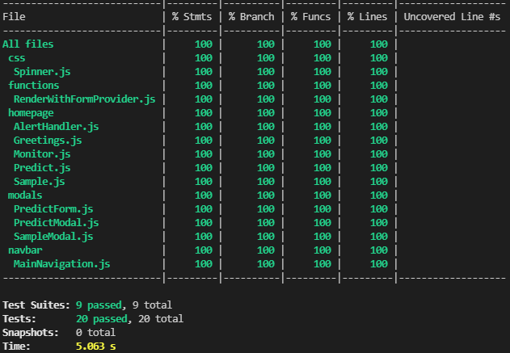
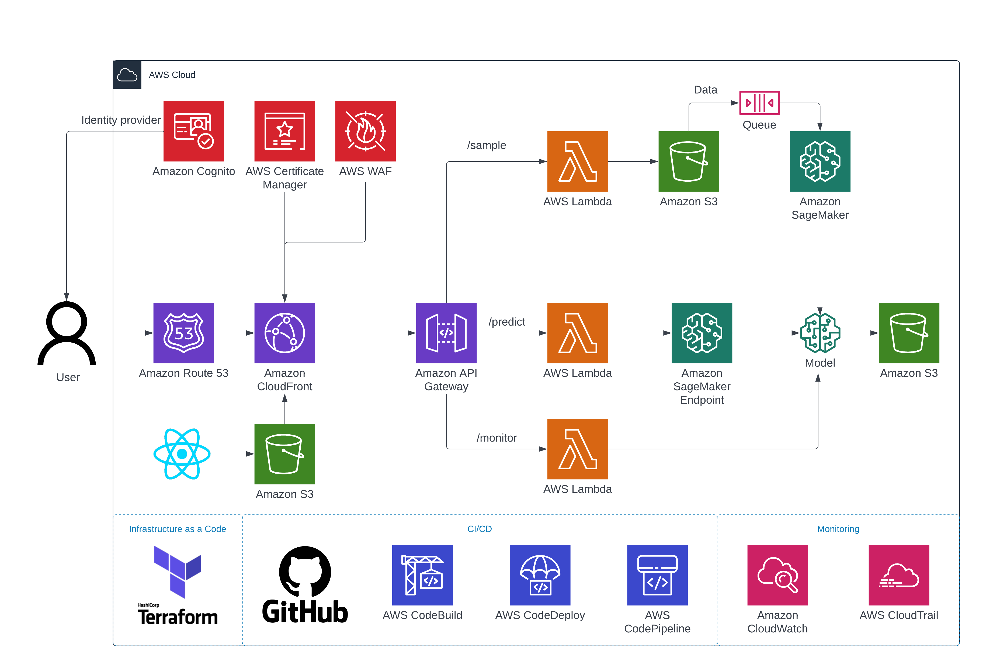
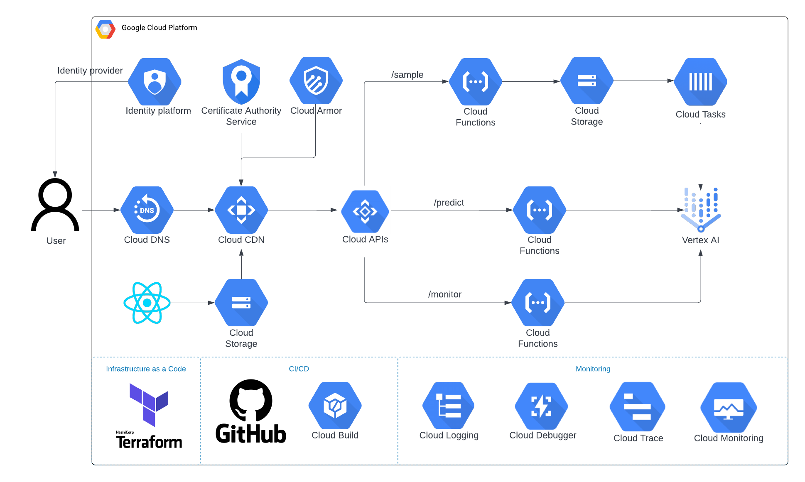

# Online Learning App

This application consists of 2 main parts: front-end using React.js framework, and back-end with API definition using Python Flask framework.

## Running application

To start the application, run `app.sh` script from the root directory. Script will install virtualenv package, create new virtual environment called `venv` and then activates it.

After that, python dependencies (`./backend/requirements.txt`) are installed as well as Node.js dependencies (`./frontend/package.json`), followed by unit tests for both parts of the application.

In the last step, script will run simultaneously localhost servers for both front- (port 3000) and back-end (port 5000).

## Back-end

3 simple endpoints defined using Flask framework. All endpoints are following "fail-as-soon-as-possible" principles (e.g., request body validation) and are trying to cover most of the possible outcomes in order to always return custom generated status code and message instead of generic "Server Error".

### `/sample`

Accepts POST requests only as **list of JSON dictionaries** with following keys: _CompanyId, BankEntryDate, BankEntryText, BankEntryAmount, AccountName, AccountNumber, AccountTypeName_.

Before invoking ModelHandling class, the request body is validated using `jsonschema` package. Rules:

- each key must be present,
- no additional key is allowed,
- each value must be string,
- _AccountTypeName_ accepts only 2 values: `['Balance', 'Profit and Loss']`.

If any rule is breached, endpoint returns 400: Validation Error.

Next step is to merge incoming data with `samples.csv` dataset or creating file if it does not exist.

After that, if model has been previously trained (model file exists), predictions for the whole datasets are made to evaluate model accuracy.

Last step is to train new model using all data - existing and newly added.

**Weak points**

- compute limitations when processing a large amount of data.

**Solution**

- Clouds!

### `/predict`

Accepts POST requests only as **JSON dictionaries** with following keys: _CompanyId, BankEntryDate, BankEntryText, BankEntryAmount_.

Before invoking ModelHandling class, the request body is validated using `jsonschema` package. Rules:

- each key must be present,
- no additional key is allowed,
- each value must be string.

If any rule is breached, endpoint returns 400: Validation Error. Same principal as `/sample` endpoint with slightly different request body validation.

If there is no model file, endponit returns 400, else the prediction is ran and returned is JSON list containing 1 string element (predicted _AccountNumber_).

**Weak points**

- current model is using obfuscated data, therefore it is possible to run predictions on gibberish data, such as _CompanyId: asdf_ etc., as there is no client-side input validation on front-end part.

**Solution**

- use server-side data anonymization as a part of both `/sample` and `/predict` endpoints. In that case, user could input the real data in both cases and there could be some client-side input validation on front-end part (or warning at least).

### `/monitor`

Accepts GET requests only.

Returns `precision_score`, `recall_score` and `accuracy_score` if dataset consists of more than 10,000 records. Metrics are calculated on the most recent 1000 predictions.

### Unit testing

Needs a bit more attention. Current solution is not correctly implemented, as there is "live" database and model file in model directory. However, when migrating system to Cloud, mocking service endpoints will eliminate this issue.

Tested are all endpoints with test events located in separate folder for both "200" and "400" status code result.

## Front-end

Simple single-page-application with basic functions of making requests to aforementioned endpoints. Input data is handled using `react-hook-form` package.

After clicking on related button, a modal with input fields will popup.

- In case of a request to `/sample` endpoint, there is only 1 input field: textarea, where a user is prompted to input list of JSON files.
- In case of a request to `/predict` endpoint, there are multiple textarea input fields. Inputs are automatically combined to valid JSON format and sent as request body.

In case of `/monitor`, request is made automatically on page load.

**Weak points**

- no front-end input validation for `/sample` request - in case of invalid data, a request is made (although failing on JSON validation step).
- adding more metrics to monitor, a chart perhaps.

**Solution**

- adding custom validation rule to tetxtarea filed for `/sample` request.

### Unit testing

100 % coverage on function components (except index.js and App.js, as per best practice with React application unit testing). 9 tests suites with 20 total tests, using `jest` and `react-testing-library` packages.

## Future work

Of course, turning proposed system into production would require multiple changes to architecture. Following diagrams count on cloud services, namely Amazon Web Services and Google Cloud Platform deployment. As shown in diagrams, security, scalability of service and dataset and application decoupling principles were taken into account.

### Amazon Web Services

### Google Cloud Platform

